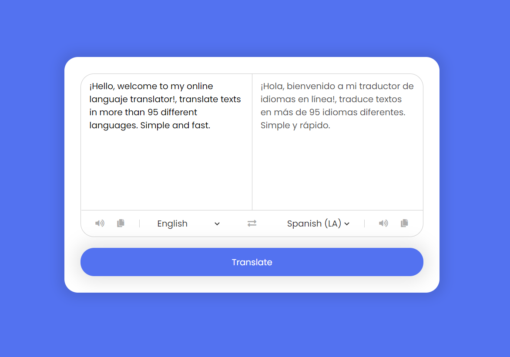

<div align="center">
  
  
  
  
  
  
  
  
  

  <h2 align="center">Language Translator, translate texts in more than 95 different languages. Simple and fast. - By: Josue Fischer</h2>

  Responsive for all devices, built using HTML, CSS, and JavaScript.

  <a href="https://iamjosuefischer.github.io/languaje-translator/"><strong>➥ Live Demo</strong></a>

<br />
  
### Demo Screenshot
  
</div>



### Prerequisites

Before you begin, ensure you have met the following requirements:

* [Git](https://git-scm.com/downloads "Download Git") must be installed on your operating system.

### Run Locally

To run **Languaje Translator** locally, run this command on your git bash or terminal:

Linux and macOS:

```bash
sudo git clone https://github.com/iamjosuefischer/languaje-translator.git
```

Windows:

```bash
git clone https://github.com/iamjosuefischer/languaje-translator.git
```

### Contact

If you want to contact with me you can reach me at [E-mail](mailto:josuefischercraft@gmail.com).

### License

This project contains an **MIT License.**
